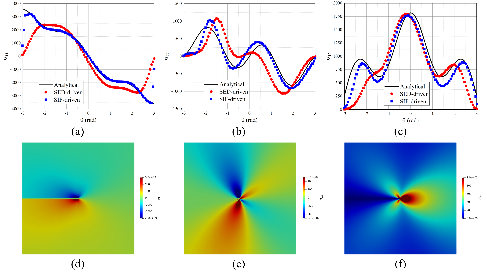

# SIF-PFM

 stress-intensity-factor-driven phase field formulation of fracture

## Installation

The latest FEniCSx version (FEniCSx 0.9) is required to run the ipynb files. To install FEniCSx correctly, please refer to [this page](https://fenicsproject.org/download/).

## Governing Equation

The weak form governing equation for displacement field writes

$$\delta\Pi_u=\int_\Omega\left[H(\phi-\phi_{cr})+k\right]\sigma_{ij}\delta\epsilon_{ij}\,\mathrm{d}\Omega~,$$

where $H(\bullet)$ stands for Heaviside step function, $\phi$ is the cracking phase-field, $\phi_{cr}, k$ are parameters in cracking phase-field, and $\sigma_{ij}, \epsilon_{ij}$ denote the stress and strain, respectively.

The weak form governing equation for cracking phase-field wirtes

$$\delta\Pi_\phi=\int_\Omega \frac{\pi \langle\sigma_{\theta\theta}\rangle_+^2}{E'}(\phi-2)\delta\phi +  
G_c\left[l_0\frac{\partial\phi}{\partial x_i} \frac{\partial\phi}{\partial x_i}+\frac{1}{l_0}\phi\delta\phi\right]\,\mathrm{d}\Omega$$

where $\langle\bullet\rangle _+$ represents Macaulay brackets, $E':=E$ in plane stress cases and $E':=E/(1-\nu^2)$ in plane strain and 3D cases, $\sigma_{\theta\theta}$ denotes the circumferential stress, and $l_0$ is another parameter in cracking phase-field.

## Examples

### Example 1: A plate with an edge notch subjected to mode I loading

The source code for this example is 'SIF-mode1.ipynb', and the corresponding results can be found in the folder 'mode1'. As shown below, the stress concentration at the crack tip is preserved with loading increasing.

The bearing capacity and critical stress intensity factor obtained by the proposed formulation is closer to the analytical values, compared with conventional SED-driven formulation, as shown below.

### Example 2: A plate with an edge notch subjected to mode II loading

The source code for this example is 'SIF-mode2.ipynb', and the corresponding results can be found in the folder 'mode2'. Similar to example 1, the stress concentration at the crack tip is preserved with loading increasing.

In addition, the overall response predicted by the propose formulation is more accurate.

### Example 3: Gypsum specimen with center flaw

The source code for this example is 'SIF-gypsum.ipynb', and the corresponding results can be found in the folder 'gypsum'. Through this example, we aim to demonstrate the capability of the proposed formulation in dealing with mixed-mode fracture problems. The simulated crack propagation process is given below.

# Code Availability and Licensing
The source code developed for this study will be made publicly available and distributed under the terms of the MIT License, which permits reuse, modification, and distribution. We encourage researchers to use and build upon this code for their own work. If you do so, we kindly ask that you acknowledge this contribution by citing our paper.

[Xuan Hu, Shaofan Li, A stress-intensity-factor-driven phase field modeling of mixed mode fracture. Computer Methods in Applied Mechanics and Engineering 443 (2025): 118058](https://doi.org/10.1016/j.cma.2025.118058)